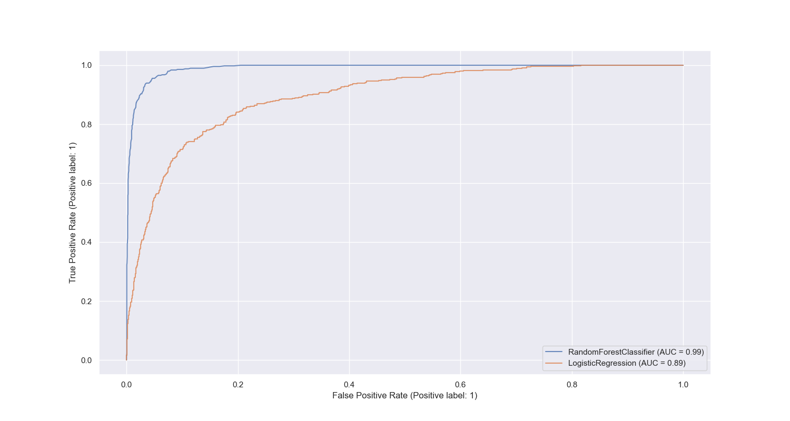
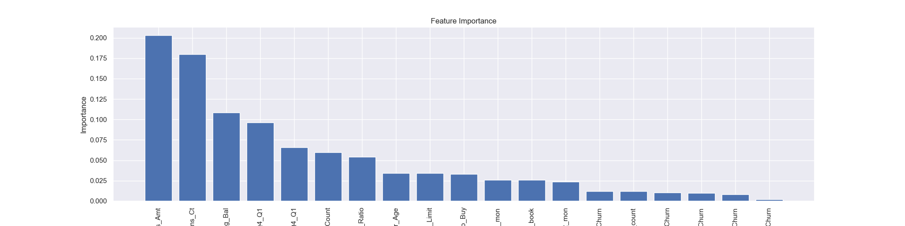

# Predict Customer Churn with Clean Code

## Project Description
This is a project to implement best coding practices.
```
├── README.md
├── churn_library.py
├── churn_script_logging_and_tests.py
├── data
├── images
│   ├── eda
│   └── results
├── logs
├── models
└── requirements.txt
```

## Install
```bash
pip install -r requirements.txt
```

## Usage
```bash
python churn_library.py
```


## Result
### Logistic Regression
```
test results
              precision    recall  f1-score   support

           0       0.90      0.96      0.93      2543
           1       0.71      0.45      0.55       496

    accuracy                           0.88      3039
   macro avg       0.81      0.71      0.74      3039
weighted avg       0.87      0.88      0.87      3039

train results
              precision    recall  f1-score   support

           0       0.91      0.96      0.94      5957
           1       0.72      0.50      0.59      1131

    accuracy                           0.89      7088
   macro avg       0.82      0.73      0.76      7088
weighted avg       0.88      0.89      0.88      7088
```

### Random Forest
```
test results
              precision    recall  f1-score   support

           0       0.96      0.99      0.98      2543
           1       0.93      0.80      0.86       496

    accuracy                           0.96      3039
   macro avg       0.95      0.90      0.92      3039
weighted avg       0.96      0.96      0.96      3039

train results
              precision    recall  f1-score   support

           0       1.00      1.00      1.00      5957
           1       1.00      1.00      1.00      1131

    accuracy                           1.00      7088
   macro avg       1.00      1.00      1.00      7088
weighted avg       1.00      1.00      1.00      7088
```

### ROC Curve


## Feature Importance



## Test
```bash
python churn_script_logging_and_tests.py
```

## Code Quality
Style Guide - Format your refactored code using PEP 8 – Style Guide. Running the command below can assist with formatting. To assist with meeting pep 8 guidelines, use autopep8 via the command line commands below:
```bash
autopep8 --in-place --aggressive --aggressive churn_script_logging_and_tests.py
autopep8 --in-place --aggressive --aggressive churn_library.py
```

Style Checking and Error Spotting - Use Pylint for the code analysis looking for programming errors, and scope for further refactoring. You should check the pylint score using the command below.
```bash
pylint churn_library.py
pylint churn_script_logging_and_tests.py
```


## Sequence Diagram

